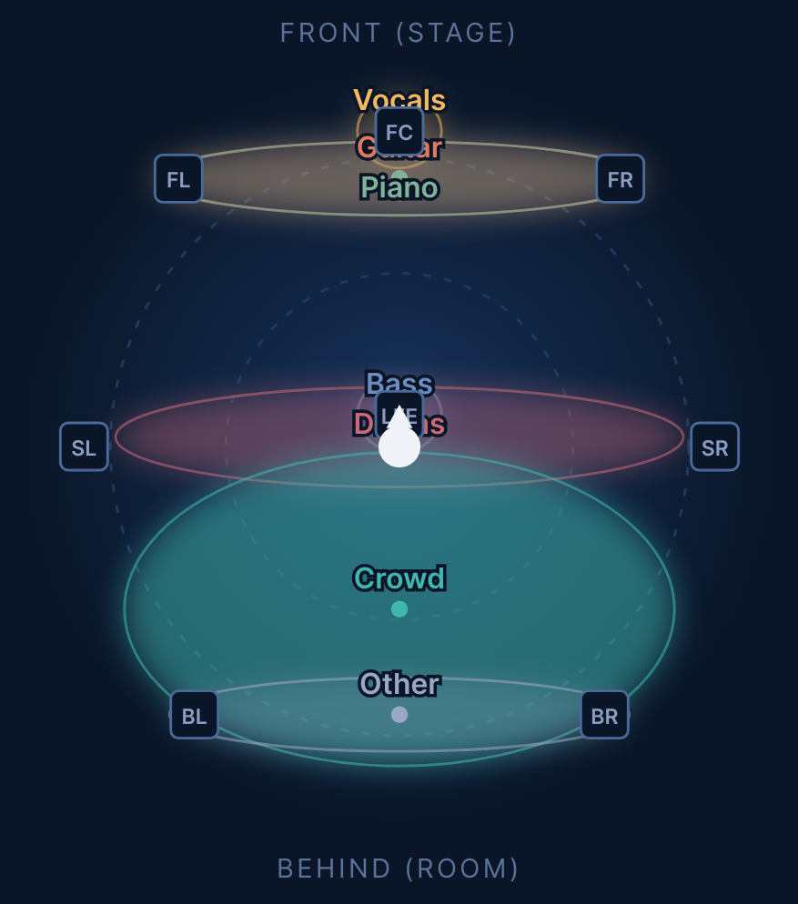

# Natural Perspective Spatial Audio

Turn any recording into a 7.1 surround mix. After a song is split into its
instrument stems, a model invents a scene and decides where each instrument
sits around you — then a deterministic renderer builds a lossless 8-channel
(7.1) FLAC for your media server.



*One real mix: every stem placed on the stage, the crowd behind you.*

## See it — no install

Open **[`examples/index.html`](examples/index.html)** in any browser, on any OS.
It's a finished mix's scene, soundstage, routing, and stem levels — the actual
output of the tool.

## Run it

```bash
pip install .              # the model layer: pip install '.[natural]'
spatial-standards song.flac          # also: a folder, or a URL
spatial-standards-gui                # or the GUI
```

Needs **FFmpeg** and **Demucs** on your PATH — plus **audio-separator** (live
crowd handling) and **yt-dlp** (URL inputs). The base install has no required
Python packages. The model layer needs an `ANTHROPIC_API_KEY`; without one the
tool falls back to a built-in mix and runs fully offline.

Output drops straight into Plex/Jellyfin/Kodi:

```
<Artist>/Natural Perspective Spatial Audio/<Title> [...].flac   (+ per-album index.html)
```

## How it works

Separate stems → measure each stem's level → a model invents a scene and emits a
full mix [configuration](CONFIG_SCHEMA.md) → a safety-clamped renderer builds the
7.1 FLAC. **No audio is uploaded** — only metadata, cover art, and the measured
stem levels inform the design. Every track saves its config and an `index.html`
documenting the scene, routing, and the exact model prompt/response.

## Your responsibility, and credits

By processing a file or URL you affirm you have the right to it. This tool hosts
no content and ships no audio. See [`NOTICE`](NOTICE) for that and full credit to
the projects it builds on — FFmpeg, Demucs, audio-separator, yt-dlp, and the
Mel-Band RoFormer crowd model.

## License

Apache-2.0 — see [`LICENSE`](LICENSE) and [`NOTICE`](NOTICE). Provided **as is**,
without warranty of any kind.
